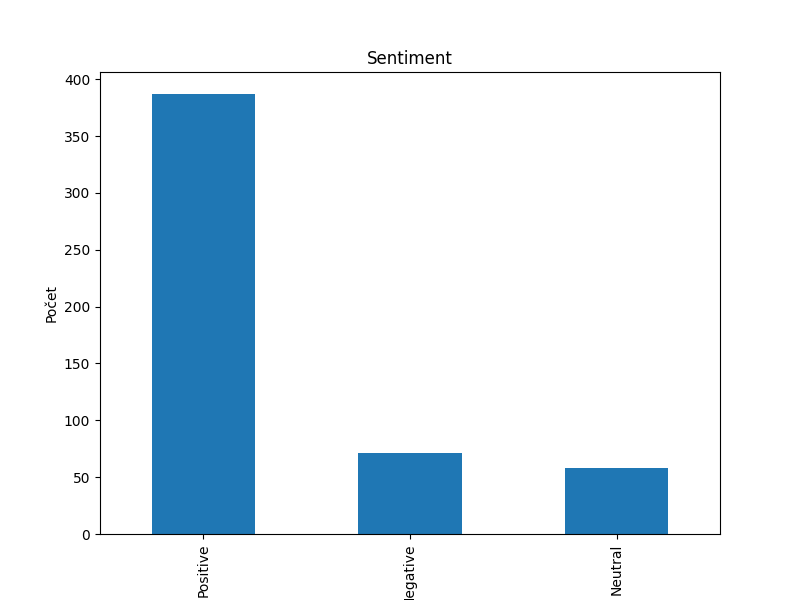
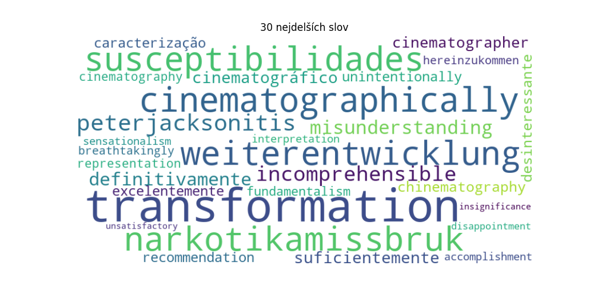
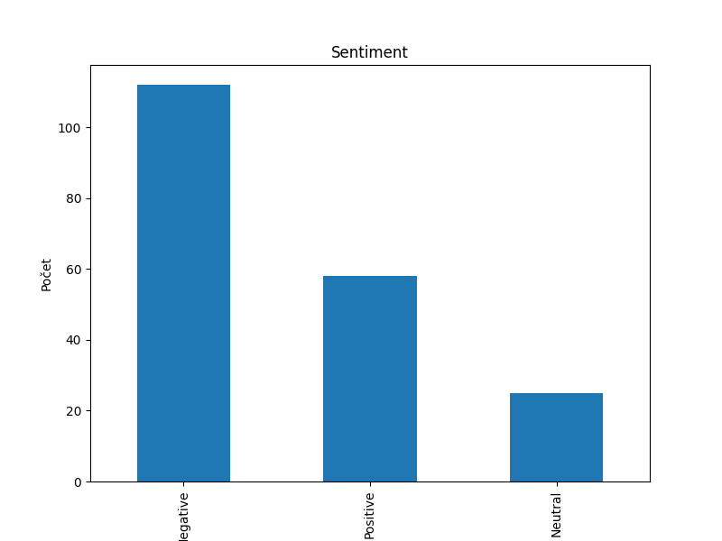
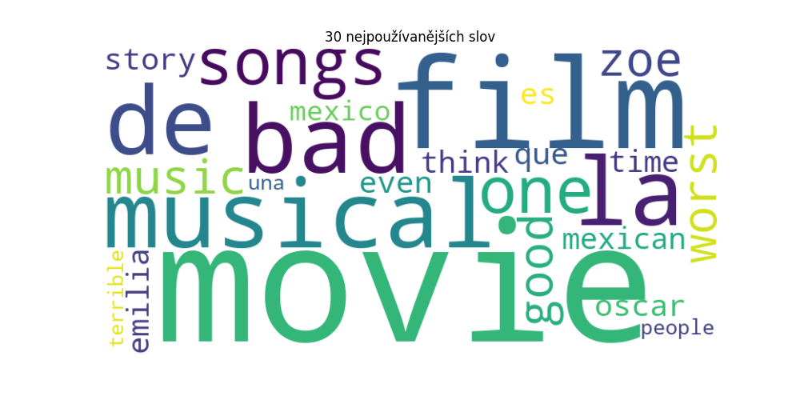
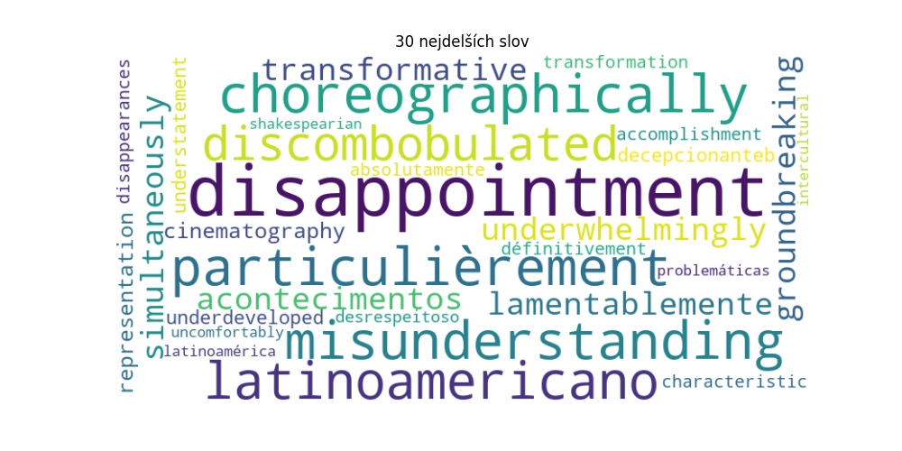

# Analýza sentimentu recenzí - Rotten tomatoes
*Nepodařilo se mi dynamicky načítat data – buď docházelo k SSL chybě, nebo jsem nemohl načíst více než 20 filmových recenzí a to mi nepřišlo relevantní. Takže jsem si stáhla html stránky a analyzovala data z tama.   Zkoušela jsem ještě booking, airbnb, ebay a aliexpress, ale všechny mají dobře implementovaný anti-scrapping asi.*

## URL stránky s recenzemi
- https://www.rottentomatoes.com/m/dune_part_two/reviews?type=user

## Výsledky analýzy sentimentu

sentiment
Positive    387
Negative     71
Neutral      58

## Sentiment Analysis Plot

## Výsledku analýzy sentimentu

## 30 nejpoužívanějších slov

[('movie', 302), ('dune', 218), ('part', 201), ('film', 187), ('one', 182), ('first', 130), ('story', 116), ('great', 105), ('two', 97), ('paul', 93), ('best', 91), ('like', 74), ('good', 74), ('book', 73), ('much', 72), ('better', 68), ('time', 68), ('de', 67), ('villeneuve', 62), ('amazing', 58), ('movies', 58), ('see', 55), ('epic', 52), ('really', 52), ('even', 51), ('la', 51), ('characters', 50), ('could', 50), ('action', 49), ('acting', 48)]

## Word cloud 30 nejpoužívanějších slov

## 30 nejdelších slov

['cinematographically', 'weiterentwicklung', 'narkotikamissbruk', 'susceptibilidades', 'peterjacksonitis', 'incomprehensible', 'misunderstanding', 'definitivamente', 'transformations', 'cinematográfico', 'suficientemente', 'cinematographer', 'chinematography', 'desinteressante', 'unintentionally', 'caracterização', 'recommendation', 'excelentemente', 'fundamentalism', 'cinematography', 'representation', 'breathtakingly', 'hereinzukommen', 'accomplishment', 'sensationalism', 'transformation', 'interpretation', 'disappointment', 'insignificance', 'unsatisfactory']

## Word cloud 30 nejdelších slov

## URL stránky s recenzemi

- https://www.rottentomatoes.com/m/emilia_perez/eviews?type=user

## Výsledky analýzy sentimentu

sentiment
Negative    112
Positive     58
Neutral      25

## Sentiment Analysis Plot

## Výsledku analýzy sentimentu

## 30 nejpoužívanějších slov

[('movie', 102), ('film', 61), ('musical', 51), ('like', 37), ('la', 35), ('de', 35), ('bad', 34), ('songs', 31), ('one', 30), ('music', 29), ('worst', 28), ('good', 28), ('zoe', 28), ('story', 28), ('que', 28), ('oscar', 27), ('es', 25), ('could', 25), ('even', 25), ('mexican', 25), ('think', 23), ('time', 23), ('ever', 22), ('emilia', 21), ('mexico', 21), ('people', 21), ('would', 20), ('movies', 20), ('terrible', 19), ('una', 18)]

## Word cloud 30 nejpoužívanějších slov

## 30 nejdelších slov

['choreographically', 'particulièrement', 'misunderstanding', 'latinoamericano', 'discombobulated', 'underwhelmingly', 'lamentablemente', 'disappointments', 'acontecimentos', 'transformative', 'simultaneously', 'groundbreaking', 'cinematography', 'representation', 'decepcionanteb', 'understatement', 'underdeveloped', 'accomplishment', 'transformation', 'characteristic', 'disappointment', 'disappearances', 'définitivement', 'absolutamente', 'desrespeitoso', 'problemáticas', 'latinoamérica', 'intercultural', 'shakespearian', 'uncomfortably']

## Word cloud 30 nejdelších slov

## URL stránky s recenzemi

- https://www.rottentomatoes.com/m/inside_out_2/eviews?type=user

## Výsledky analýzy sentimentu

sentiment
Positive    147
Negative     23
Neutral      16

## Sentiment Analysis Plot

## Výsledku analýzy sentimentu

## 30 nejpoužívanějších slov

[('movie', 103), ('good', 61), ('first', 53), ('emotions', 52), ('inside', 52), ('film', 49), ('one', 47), ('pixar', 40), ('new', 39), ('like', 39), ('anxiety', 37), ('riley', 36), ('great', 33), ('original', 30), ('loved', 29), ('sequel', 29), ('better', 27), ('still', 22), ('much', 22), ('story', 21), ('feel', 19), ('characters', 18), ('really', 18), ('even', 17), ('fun', 16), ('emotion', 15), ('would', 15), ('emotional', 13), ('watch', 13), ('kids', 13)]

## Word cloud 30 nejpoužívanějších slov

## 30 nejdelších slov

['reinterpretation', 'misunderstanding', 'spectrumtheatre', 'disappointments', 'transformative', 'underperformed', 'recommendation', 'groundbreaking', 'representation', 'breathtakingly', 'disappointment', 'entertainment', 'interpersonal', 'uncomfortable', 'incrívelmente', 'embarrassment', 'grandchildren', 'unfortunately', 'psychological', 'personalities', 'worldbuilding', 'psychologists', 'circumstances', 'disappointing', 'relationships', 'understanding', 'consistently', 'lighthearted', 'entertaining', 'headquarters']

## Word cloud 30 nejdelších slov

